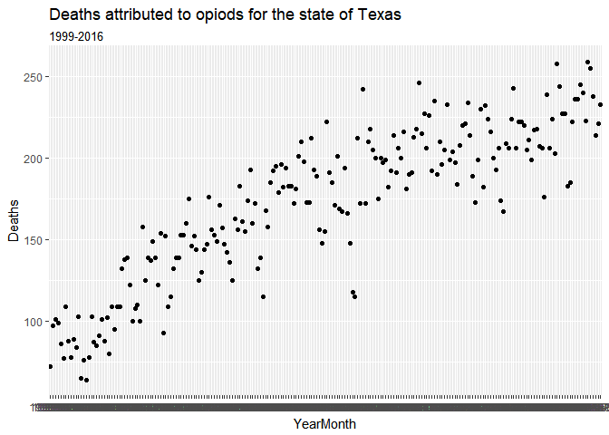
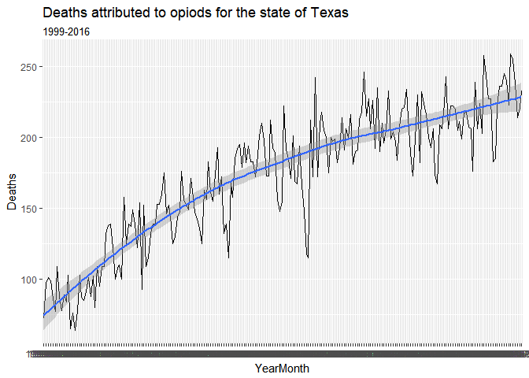
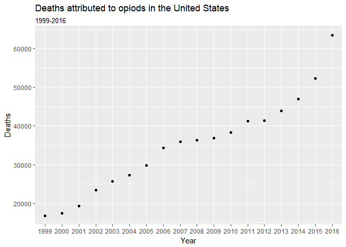
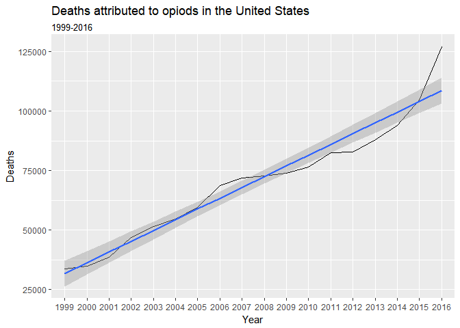
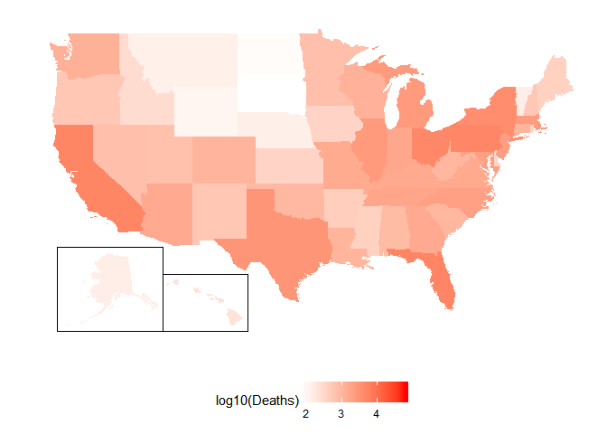

Analysis of Opiod drug overdoses data from the CDC
==================================================

Carlos Santillan

<csantill@gmail.com>

<https://www.linkedin.com/in/carlos-santillan/>

Load the data
-------------

Load CDC data Dataset: Underlying Cause of Death, 1999-2016

### Load Monthly Data

Group By: State, Year, Month, ICD Chapter

ICD-10 Codes:

-   X40 (Accidental poisoning by and exposure to nonopioid analgesics,
    antipyretics and antirheumatics)
-   X41 (Accidental poisoning by and exposure to antiepileptic,
    sedative-hypnotic, antiparkinsonism and psychotropic drugs, not
    elsewhere classified)
-   X42 (Accidental poisoning by and exposure to narcotics and
    psychodysleptics \[hallucinogens\], not elsewhere classified)
-   X43 (Accidental poisoning by and exposure to other drugs acting on
    the autonomic nervous system)
-   X44 (Accidental poisoning by and exposure to other and unspecified
    drugs, medicaments and biological substances)
-   X60 (Intentional self-poisoning by and exposure to nonopioid
    analgesics, antipyretics and antirheumatics)
-   X61 (Intentional self-poisoning by and exposure to antiepileptic,
    sedative-hypnotic, antiparkinsonism and psychotropic drugs, not
    elsewhere classified)
-   X62 (Intentional self-poisoning by and exposure to narcotics and
    psychodysleptics \[hallucinogens\], not elsewhere classified)
-   X63 (Intentional self-poisoning by and exposure to other drugs
    acting on the autonomic nervous system)
-   X64 (Intentional self-poisoning by and exposure to other and
    unspecified drugs, medicaments and biological substances)
-   Y10 (Poisoning by and exposure to nonopioid analgesics, antipyretics
    and antirheumatics, undetermined intent)
-   Y11 (Poisoning by and exposure to antiepileptic, sedative-hypnotic,
    antiparkinsonism and psychotropic drugs, not elsewhere classified,
    undetermined intent),
-   Y12 (Poisoning by and exposure to narcotics and psychodysleptics
    \[hallucinogens\], not elsewhere classified, undetermined intent)
-   Y13 (Poisoning by and exposure to other drugs acting on the
    autonomic nervous system, undetermined intent)
-   Y14 (Poisoning by and exposure to other and unspecified drugs,
    medicaments and biological substances, undetermined intent)

Source:

Centers for Disease Control and Prevention, National Center for Health
Statistics. Underlying Cause of Death 1999-2016 on CDC WONDER Online
Database, released December, 2017. Data are from the Multiple Cause of
Death Files, 1999-2016, as compiled from data provided by the 57 vital
statistics jurisdictions through the Vital Statistics Cooperative
Program. Accessed at <http://wonder.cdc.gov/ucd-icd10.html> on Feb 10,
2018 4:36:12 PM

-   Note: Year, Month data for the state of South Dakota and North
    Dakota was unavailable due to CDC Suppression, data was inputed by
    floor (AnnualDeaths/ 12 ) for each year

Use of this data allowed under <https://wonder.cdc.gov/DataUse.html#>

CDC Data was generated from the following Query
<https://wonder.cdc.gov/controller/saved/D76/D29F799>

    ## Parsed with column specification:
    ## cols(
    ##   Notes = col_character(),
    ##   State = col_character(),
    ##   `State Code` = col_character(),
    ##   Year = col_integer(),
    ##   `Year Code` = col_integer(),
    ##   Month = col_character(),
    ##   `Month Code` = col_character(),
    ##   `ICD Chapter` = col_character(),
    ##   `ICD Chapter Code` = col_character(),
    ##   Deaths = col_integer(),
    ##   Population = col_character(),
    ##   `Crude Rate` = col_character()
    ## )

### Load Annual Data

Group By: State, Year, ICD Chapter

ICD-10 Codes:

-   X40 (Accidental poisoning by and exposure to nonopioid analgesics,
    antipyretics and antirheumatics)
-   X41 (Accidental poisoning by and exposure to antiepileptic,
    sedative-hypnotic, antiparkinsonism and psychotropic drugs, not
    elsewhere classified)
-   X42 (Accidental poisoning by and exposure to narcotics and
    psychodysleptics \[hallucinogens\], not elsewhere classified)
-   X43 (Accidental poisoning by and exposure to other drugs acting on
    the autonomic nervous system)
-   X44 (Accidental poisoning by and exposure to other and unspecified
    drugs, medicaments and biological substances)
-   X60 (Intentional self-poisoning by and exposure to nonopioid
    analgesics, antipyretics and antirheumatics)
-   X61 (Intentional self-poisoning by and exposure to antiepileptic,
    sedative-hypnotic, antiparkinsonism and psychotropic drugs, not
    elsewhere classified)
-   X62 (Intentional self-poisoning by and exposure to narcotics and
    psychodysleptics \[hallucinogens\], not elsewhere classified)
-   X63 (Intentional self-poisoning by and exposure to other drugs
    acting on the autonomic nervous system)
-   X64 (Intentional self-poisoning by and exposure to other and
    unspecified drugs, medicaments and biological substances)
-   Y10 (Poisoning by and exposure to nonopioid analgesics, antipyretics
    and antirheumatics, undetermined intent)
-   Y11 (Poisoning by and exposure to antiepileptic, sedative-hypnotic,
    antiparkinsonism and psychotropic drugs, not elsewhere classified,
    undetermined intent),
-   Y12 (Poisoning by and exposure to narcotics and psychodysleptics
    \[hallucinogens\], not elsewhere classified, undetermined intent)
-   Y13 (Poisoning by and exposure to other drugs acting on the
    autonomic nervous system, undetermined intent)
-   Y14 (Poisoning by and exposure to other and unspecified drugs,
    medicaments and biological substances, undetermined intent)

Source:

Centers for Disease Control and Prevention, National Center for Health
Statistics. Underlying Cause of Death" "1999-2016 on CDC WONDER Online
Database, released December, 2017. Data are from the Multiple Cause of
Death Files, 1999-2016, as" "compiled from data provided by the 57 vital
statistics jurisdictions through the Vital Statistics Cooperative
Program. Accessed" "at <http://wonder.cdc.gov/ucd-icd10.html> on Feb 13,
2018 11:26:09 AM"

Use of this data allowed under <https://wonder.cdc.gov/DataUse.html#>

CDC Data was generated from the following Query
<https://wonder.cdc.gov/controller/saved/D76/D29F799>
<https://wonder.cdc.gov/controller/saved/D76/D30F044>

    ## Parsed with column specification:
    ## cols(
    ##   Notes = col_character(),
    ##   State = col_character(),
    ##   `State Code` = col_character(),
    ##   Year = col_integer(),
    ##   `Year Code` = col_integer(),
    ##   `ICD Chapter` = col_character(),
    ##   `ICD Chapter Code` = col_character(),
    ##   Deaths = col_integer(),
    ##   Population = col_integer(),
    ##   `Crude Rate` = col_character()
    ## )

Load Geo data
-------------

Latitudeo and Longitude Coordinates for each state were downloaded from
<https://inkplant.com/code/state-latitudes-longitudes>

### Exploration

    ## Classes 'tbl_df', 'tbl' and 'data.frame':    9415 obs. of  7 variables:
    ##  $ State     : chr  "Alabama" "Alabama" "Alabama" "Alabama" ...
    ##  $ YearMonth : chr  "1999-01" "1999-02" "1999-03" "1999-04" ...
    ##  $ Year      : chr  "1999" "1999" "1999" "1999" ...
    ##  $ Month.Code: chr  "01" "02" "03" "04" ...
    ##  $ Deaths    : int  17 13 10 14 13 20 11 20 21 17 ...
    ##  $ Lat       : num  32.8 32.8 32.8 32.8 32.8 ...
    ##  $ Long      : num  -86.8 -86.8 -86.8 -86.8 -86.8 ...

    ## # A tibble: 6 x 7
    ##   State   YearMonth Year  Month.Code Deaths   Lat  Long
    ##   <chr>   <chr>     <chr> <chr>       <int> <dbl> <dbl>
    ## 1 Alabama 1999-01   1999  01             17  32.8 -86.8
    ## 2 Alabama 1999-02   1999  02             13  32.8 -86.8
    ## 3 Alabama 1999-03   1999  03             10  32.8 -86.8
    ## 4 Alabama 1999-04   1999  04             14  32.8 -86.8
    ## 5 Alabama 1999-05   1999  05             13  32.8 -86.8
    ## 6 Alabama 1999-06   1999  06             20  32.8 -86.8

    ##     State            YearMonth             Year          
    ##  Length:9415        Length:9415        Length:9415       
    ##  Class :character   Class :character   Class :character  
    ##  Mode  :character   Mode  :character   Mode  :character  
    ##                                                          
    ##                                                          
    ##                                                          
    ##   Month.Code            Deaths            Lat             Long        
    ##  Length:9415        Min.   :  1.00   Min.   :21.09   Min.   :-157.50  
    ##  Class :character   1st Qu.: 22.50   1st Qu.:35.57   1st Qu.: -99.78  
    ##  Mode  :character   Median : 47.00   Median :39.06   Median : -88.99  
    ##                     Mean   : 66.06   Mean   :38.90   Mean   : -92.37  
    ##                     3rd Qu.: 82.00   3rd Qu.:42.23   3rd Qu.: -79.81  
    ##                     Max.   :546.00   Max.   :61.37   Max.   : -69.38

    ## [1] "Deaths reported in 2016 "

    ## [1] 63318

    ## [1] "Deaths reported in the state of Texas 2016 "

<table>
<thead>
<tr class="header">
<th align="right">x</th>
</tr>
</thead>
<tbody>
<tr class="odd">
<td align="right">2822</td>
</tr>
</tbody>
</table>

    ## # A tibble: 6 x 3
    ## # Groups:   State, YearMonth [6]
    ##   State YearMonth Deaths
    ##   <chr> <chr>      <int>
    ## 1 Texas 1999-01       72
    ## 2 Texas 1999-02       97
    ## 3 Texas 1999-03      101
    ## 4 Texas 1999-04       99
    ## 5 Texas 1999-05       86
    ## 6 Texas 1999-06       77

    ## Adding missing grouping variables: `Year`

<table>
<caption>Deaths attributed to opiods in the United State</caption>
<thead>
<tr class="header">
<th align="left">Year</th>
<th align="right">Deaths</th>
<th align="right">PercentChange</th>
</tr>
</thead>
<tbody>
<tr class="odd">
<td align="left">2016</td>
<td align="right">63,522</td>
<td align="right">21.4314389</td>
</tr>
<tr class="even">
<td align="left">2015</td>
<td align="right">52,311</td>
<td align="right">11.3616043</td>
</tr>
<tr class="odd">
<td align="left">2014</td>
<td align="right">46,974</td>
<td align="right">7.0120284</td>
</tr>
<tr class="even">
<td align="left">2013</td>
<td align="right">43,896</td>
<td align="right">5.9726715</td>
</tr>
<tr class="odd">
<td align="left">2012</td>
<td align="right">41,422</td>
<td align="right">0.3926321</td>
</tr>
<tr class="even">
<td align="left">2011</td>
<td align="right">41,260</td>
<td align="right">7.8213604</td>
</tr>
<tr class="odd">
<td align="left">2010</td>
<td align="right">38,267</td>
<td align="right">3.6091406</td>
</tr>
<tr class="even">
<td align="left">2009</td>
<td align="right">36,934</td>
<td align="right">1.5172338</td>
</tr>
<tr class="odd">
<td align="left">2008</td>
<td align="right">36,382</td>
<td align="right">1.2044841</td>
</tr>
<tr class="even">
<td align="left">2007</td>
<td align="right">35,949</td>
<td align="right">4.6550218</td>
</tr>
<tr class="odd">
<td align="left">2006</td>
<td align="right">34,350</td>
<td align="right">15.4389031</td>
</tr>
<tr class="even">
<td align="left">2005</td>
<td align="right">29,756</td>
<td align="right">8.7891196</td>
</tr>
<tr class="odd">
<td align="left">2004</td>
<td align="right">27,352</td>
<td align="right">6.2750126</td>
</tr>
<tr class="even">
<td align="left">2003</td>
<td align="right">25,737</td>
<td align="right">9.6357827</td>
</tr>
<tr class="odd">
<td align="left">2002</td>
<td align="right">23,475</td>
<td align="right">21.3052914</td>
</tr>
<tr class="even">
<td align="left">2001</td>
<td align="right">19,352</td>
<td align="right">11.3207547</td>
</tr>
<tr class="odd">
<td align="left">2000</td>
<td align="right">17,384</td>
<td align="right">3.4207865</td>
</tr>
<tr class="even">
<td align="left">1999</td>
<td align="right">16,809</td>
<td align="right">NA</td>
</tr>
</tbody>
</table>

<table>
<caption>States with Highest number of deaths for 2016</caption>
<thead>
<tr class="header">
<th align="left">State</th>
<th align="right">Deaths</th>
</tr>
</thead>
<tbody>
<tr class="odd">
<td align="left">Florida</td>
<td align="right">4,724</td>
</tr>
<tr class="even">
<td align="left">California</td>
<td align="right">4,649</td>
</tr>
<tr class="odd">
<td align="left">Pennsylvania</td>
<td align="right">4,609</td>
</tr>
<tr class="even">
<td align="left">Ohio</td>
<td align="right">4,318</td>
</tr>
<tr class="odd">
<td align="left">New York</td>
<td align="right">3,636</td>
</tr>
<tr class="even">
<td align="left">Texas</td>
<td align="right">2,822</td>
</tr>
</tbody>
</table>

<table>
<caption>States with Lowest number of deaths for 2016</caption>
<thead>
<tr class="header">
<th align="left">State</th>
<th align="right">Deaths</th>
</tr>
</thead>
<tbody>
<tr class="odd">
<td align="left">Vermont</td>
<td align="right">125</td>
</tr>
<tr class="even">
<td align="left">Nebraska</td>
<td align="right">120</td>
</tr>
<tr class="odd">
<td align="left">Montana</td>
<td align="right">118</td>
</tr>
<tr class="even">
<td align="left">Wyoming</td>
<td align="right">98</td>
</tr>
<tr class="odd">
<td align="left">North Dakota</td>
<td align="right">77</td>
</tr>
<tr class="even">
<td align="left">South Dakota</td>
<td align="right">68</td>
</tr>
</tbody>
</table>

    sessionInfo(package = NULL)

    ## R version 3.4.3 (2017-11-30)
    ## Platform: x86_64-w64-mingw32/x64 (64-bit)
    ## Running under: Windows 10 x64 (build 16299)
    ## 
    ## Matrix products: default
    ## 
    ## locale:
    ## [1] LC_COLLATE=English_United States.1252 
    ## [2] LC_CTYPE=English_United States.1252   
    ## [3] LC_MONETARY=English_United States.1252
    ## [4] LC_NUMERIC=C                          
    ## [5] LC_TIME=English_United States.1252    
    ## 
    ## attached base packages:
    ## [1] stats     graphics  grDevices utils     datasets  methods   base     
    ## 
    ## other attached packages:
    ##  [1] bindrcpp_0.2      fiftystater_1.0.1 forcats_0.2.0    
    ##  [4] stringr_1.2.0     dplyr_0.7.4       purrr_0.2.4      
    ##  [7] readr_1.1.1       tidyr_0.8.0       tibble_1.4.2     
    ## [10] ggplot2_2.2.1     tidyverse_1.2.1   knitr_1.19       
    ## 
    ## loaded via a namespace (and not attached):
    ##  [1] tidyselect_0.2.3 reshape2_1.4.3   haven_1.1.1      lattice_0.20-35 
    ##  [5] colorspace_1.3-2 htmltools_0.3.6  yaml_2.1.16      utf8_1.1.3      
    ##  [9] rlang_0.1.6      pillar_1.1.0     foreign_0.8-69   glue_1.2.0      
    ## [13] modelr_0.1.1     readxl_1.0.0     bindr_0.1        plyr_1.8.4      
    ## [17] munsell_0.4.3    gtable_0.2.0     cellranger_1.1.0 rvest_0.3.2     
    ## [21] mapproj_1.2-5    psych_1.7.8      evaluate_0.10.1  labeling_0.3    
    ## [25] parallel_3.4.3   highr_0.6        broom_0.4.3      Rcpp_0.12.15    
    ## [29] scales_0.5.0     backports_1.1.2  jsonlite_1.5     mnormt_1.5-5    
    ## [33] hms_0.4.1        digest_0.6.15    stringi_1.1.6    grid_3.4.3      
    ## [37] rprojroot_1.3-2  cli_1.0.0        tools_3.4.3      maps_3.2.0      
    ## [41] magrittr_1.5     lazyeval_0.2.1   crayon_1.3.4     pkgconfig_2.0.1 
    ## [45] xml2_1.2.0       lubridate_1.7.2  assertthat_0.2.0 rmarkdown_1.8   
    ## [49] httr_1.3.1       rstudioapi_0.7   R6_2.2.2         nlme_3.1-131    
    ## [53] compiler_3.4.3
